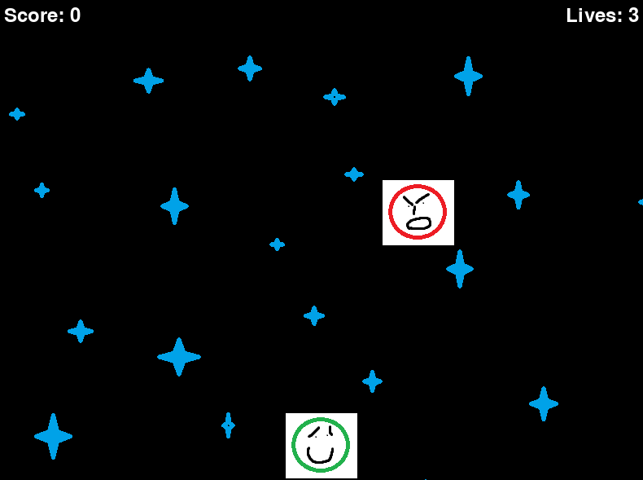

<div align="center">

# Shootik

### A retro top-down space shooter built with Python and Pygame

[](https://www.python.org/)
[](https://www.pygame.org/)
[](https://github.com/jackinf/shootik)

</div>

## Overview

Shootik is a small arcade-style space shooter game written in Python on top of the
[Pygame](https://www.pygame.org/) library. You pilot a ship along the bottom of the
screen, dodge falling meteors, and blast them with projectiles to rack up points.
The game features a scrolling background, animated sprites, sound effects, and
looping background music.



## Features

- Move the player ship left and right and fire projectiles
- Continuously spawning meteor enemies that scroll down the screen
- Collision detection between projectiles, meteors, and the player
- Score and lives tracking with a simple on-screen HUD
- Frame-based sprite animation for the player and meteors
- Infinitely scrolling background
- Background music and shooting sound effects via the Pygame mixer

## Tech Stack

| Area     | Technology |
| -------- | ---------- |
| Language | Python     |
| Engine   | Pygame     |
| Assets   | PNG sprites, MP3 music, WAV sound effects |

## Getting Started

### Prerequisites

- Python 3 with `pip`

### Installation

```bash
git clone https://github.com/jackinf/shootik.git
cd shootik
pip install -r requirements.txt
```

### Running

```bash
python main.py
```

An `800x600` game window titled "Space Shooter" will open.

#### Controls

| Key          | Action          |
| ------------ | --------------- |
| Left / Right | Move the ship   |
| Space        | Fire projectile |

## Project Structure

```
shootik/
├── main.py            # Game entry point and all game logic
├── requirements.txt   # Python dependencies (pygame)
├── assets/
│   ├── images/        # Player, meteor, projectile, and background sprites
│   ├── music/         # Background music track
│   ├── sounds/        # Shooting sound effect
│   └── raw/           # Source/raw art assets
└── about.png          # Project banner image
```
